#  Курсовая работа на профессии "DevOps-инженер с нуля"

---------
## Задача
Ключевая задача — разработать отказоустойчивую инфраструктуру для сайта, включающую мониторинг, сбор логов и резервное копирование основных данных. Инфраструктура должна размещаться в [Yandex Cloud](https://cloud.yandex.com/).

### Сайт
Cоздаем Instance Group с двумя ВМ , для которой настроим следующие правила автоматического горизонтального масштабирования: минимальное количество ВМ на зону — 1, максимальный размер группы — 3.

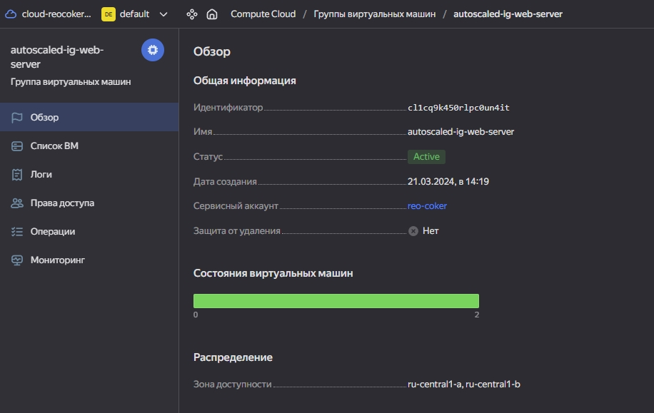
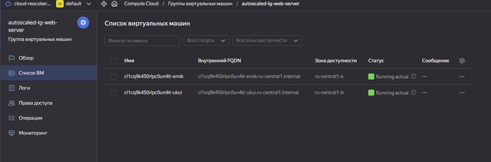

Создаем Target Group, Backend Group, HTTP router, Application load balancer:

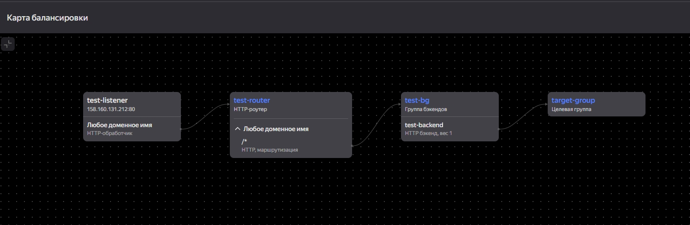
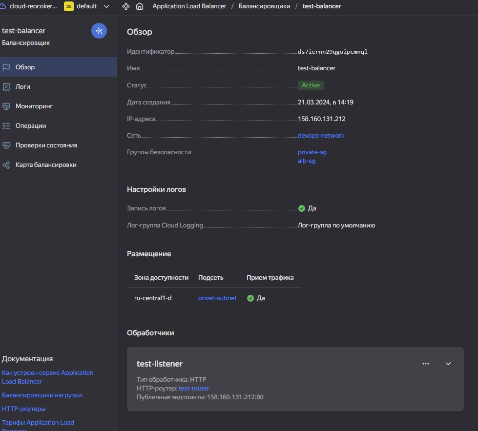
Протестируем сайт`curl -v <публичный IP балансера>:80`: 
Сайт доступен по ссылке - http://158.160.131.212

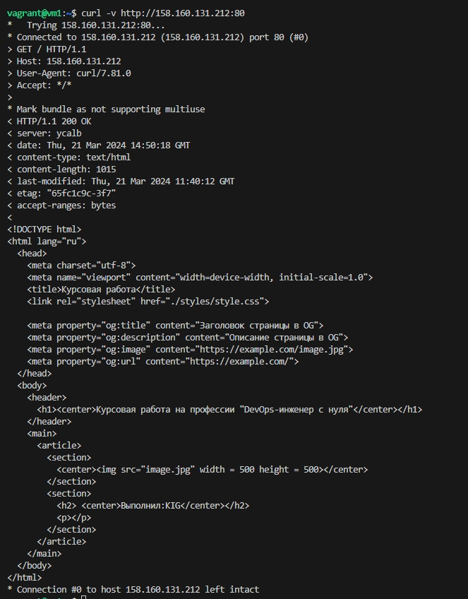

### Логи
Cоздаем две ВМ - c Elasticsearch и с Kibana ( доступ по ссылке http://158.160.129.45:5601/ ). Устанавливаем и настраиваем filebeat на все ВМ согласно заданию.

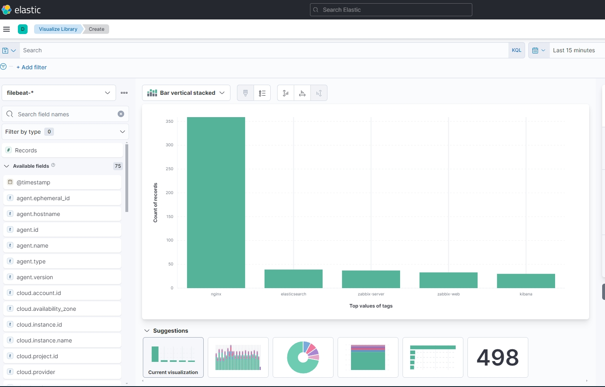

### Мониторинг
Для Zabbix реализуем разделение компонент - frontend(доступ по ссылке http://158.160.150.147/zabbix/  логин,пароль по умолчанию ), server, database. 

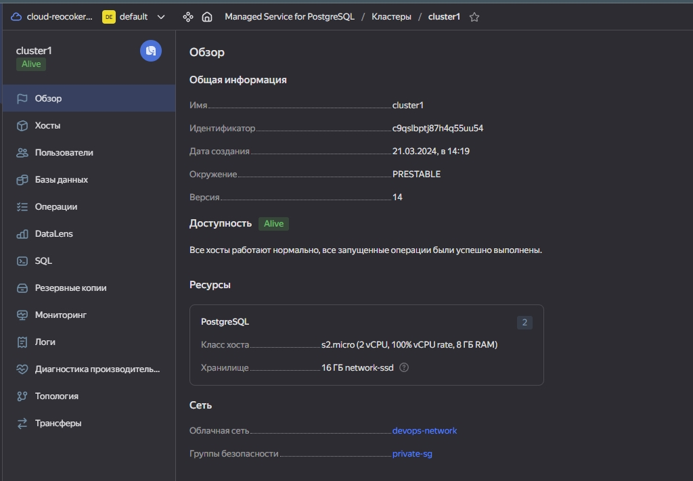
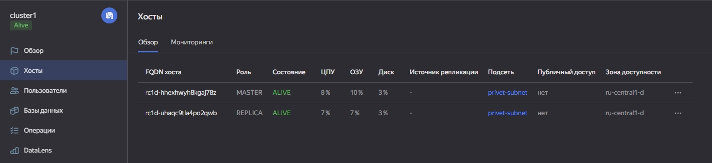
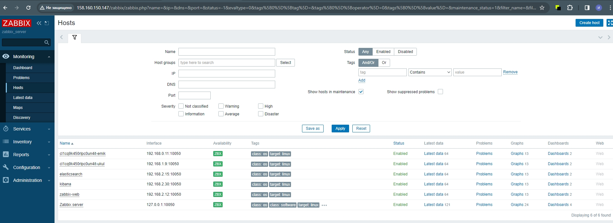
### Сеть
Реализуем концепцию bastion host используя NAT instance:
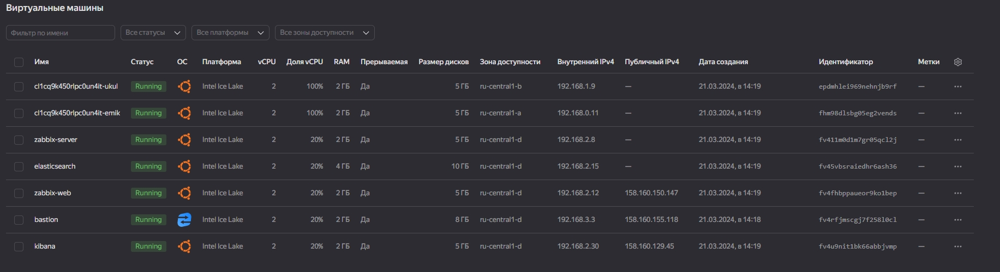
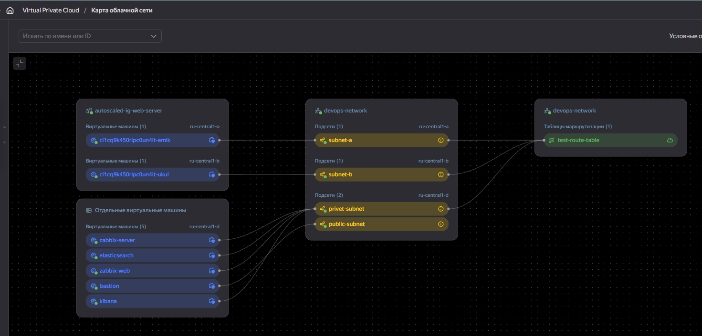
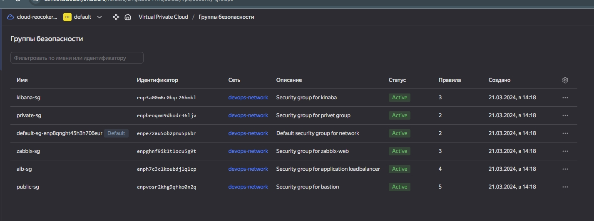

### Резервное копирование
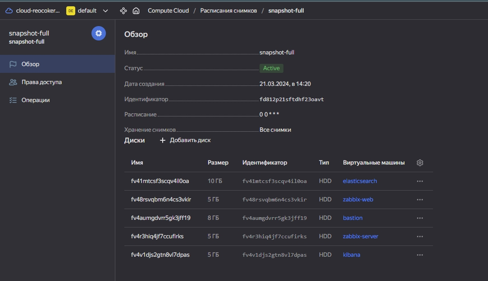

